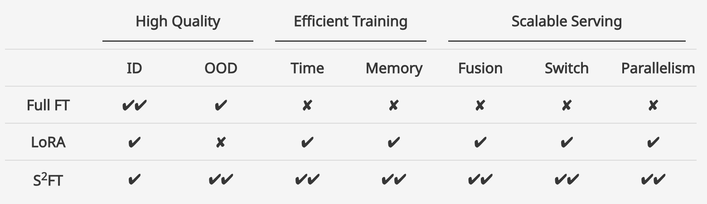

# S2FT: Efficient, Scalable and Generalizable LLM Fine-tuning by Structured Sparsity

<div align="center">
  
</div>
S2FT offers several key advantages over LoRA: (i) improved OOD performance, (2) enhanced training efficiency (time & memory), (3) better serving scalability (adapter fusion/switch/parallelism). These features are particularly valuable in real-world PEFT scenarios, where the goal is to effectively combine knowledge from various domains with the base model's capabilities using limited resource.

## Installation

### Install S2FT Layers
```bash
python setup.py install
```

### Install experiment dependencies
```bash
pip install -r requirements.txt
```

## Usage

Here, we demonstrate how to apply S2FT in training with the LLaMA architecture. See advanced usage in `experiments/train/finetune.py` (Line 266-330) and `experiments/utils/s2_utils.py`.

### Step 1: Import two basic S2 linear layers

```python
from s2ft import S2ColumnLinear, S2RowLinear
```

### Step 2: Allocate trainable rows/columns to each linear layer

```python
parameters_d = {}
intermediate_dim = model.config.intermediate_size
ffn_indices = [
    i for i in range(intermediate_dim * model.config.num_hidden_layers)
]
for i in range(model.config.num_hidden_layers):
    parameters_d[i] = []
num_d = int(intermediate_dim * model.config.num_hidden_layers * args.d_ratio)
select_d = sorted(random.sample(ffn_indices, num_d))
for d in select_d:
    parameters_d[d // intermediate_dim].append(d % intermediate_dim)
selected_parameters = {"down_proj": parameters_d}
```

### Step 3: Convert linear layers to S2 linear layers
```python
def convert_ffn_layer_to_s2(model, selected_parameters):
    for i in range(model.config.num_hidden_layers):
        layer = model.model.layers[i]
        order = selected_parameters["down_proj"][i]
        for j in range(model.config.intermediate_size):
            if j not in order:
                order.append(j)
        
        module = layer.mlp.down_proj
        checkpoint = copy.deepcopy(module.state_dict())
        layer.mlp.down_proj = S2RowLinear(
            in_features=module.in_features,
            out_features=module.out_features,
            bias=module.bias,
            start=len(only_u),
            end=(len(only_u) + len(ud) + len(only_d)),
            device=next(module.parameters()).device,
            dtype=next(module.parameters()).dtype,
        )
        layer.mlp.down_proj.load_state_dict(checkpoint, strict=False)
        del module
        del checkpoint

        u_weight = layer.mlp.up_proj.weight.data
        layer.mlp.up_proj.weight.data = u_weight[order, :]
        g_weight = layer.mlp.gate_proj.weight.data
        layer.mlp.gate_proj.weight.data = g_weight[order, :]
        d_weight = layer.mlp.down_proj.weight.data
        layer.mlp.down_proj.weight.data = d_weight[:, order]
```

## Experiments

To reproduce S2FT results on the commonsense and arithmetic reasoning dataset, refer to the instruction and code available in the `experiments` directory.

For the efficient implementation of S2FT and the related efficiency analysis code, see the `efficiency` directory.

## Citation

```bibtex
@inproceedings{yang2024s2ft,
  title={S2FT: Efficient, Scalable and Generalizable LLM Fine-tuning by Structured Sparsity},
  author={Yang, Xinyu and Leng, Jixuan and Guo, Geyang and Zhao, Jiawei and Nakada, Ryumei and Zhang, Linjun and Yao, Huaxiu and Chen, Beidi},
  booktitle={The 38th Conference on Neural Information Processing Systems (NeurIPS)},
  year={2024}
}
```