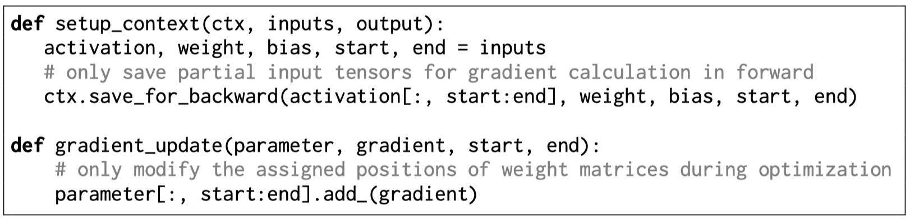

# Efficient Implementation

This directory provides an implementation of S$^2$FT to support the partial back-propagation algorithm described in Section 3.3 (see `s2ft.py`). The current implementation is designed for fine-tuning on a single GPU without gradient accumulation, as the original PyTorch framework does not natively support weights and gradients with different shapes.

<div align="center">
  
</div>

# Efficiency Analysis

We also provide the code for measuring training efficiency and inference scalability:

1. Training Time
```python
python latency.py --v_ratio 0.026 --o_ratio 0.026 --u_ratio 0.01 --d_ratio 0.01
```

2. Training Memory
```python
python memory.py --v_ratio 0.026 --o_ratio 0.026 --u_ratio 0.01 --d_ratio 0.01
```

3. Switch Time on GPU
```python
python inference/switch_time_gpu.py
```

4. Switch Time on CPU
```python
python inference/switch_time_cpu.py
```

5. Parallelism Time
```python
python inference/parallel_time.py
```
